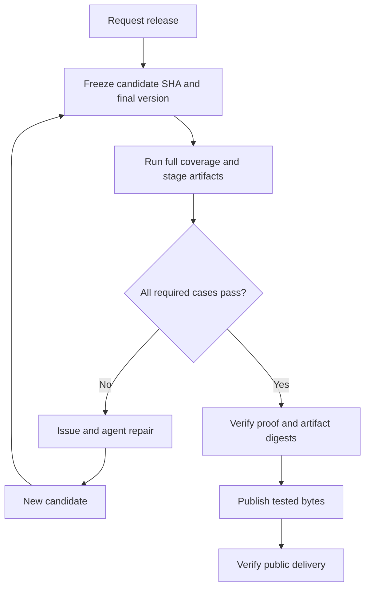

# Proposal: a verifiable CI contract for the repository fleet

> **Decision:** adopt a small, commented `ci.toml` contract built from **units → groups → events**, backed by a coverage manifest, a GitHub adapter, and one standard linter.
>
> **Reason:** keep ordinary development inexpensive while proving that scheduled validation and release candidates retain the complete required test and artifact coverage, including libc and Windows ABI variants.

**Status:** proposed; the scanner, schema, scheduler, manifest protocol, and issue synchronization described here are not implemented.
**Scope:** repositories owned by `zackees`, `FastLED`, and `TechWatchProject`; GitHub Actions first.
**Evidence collected:** 2026-09-27, including the earlier fleet audits and subsequent design validation. Historical observations are labeled below.
**Design relationship:** this proposal consolidates and revises [design issue #3](https://github.com/zackees/ci.yml/issues/3). The user explicitly requested a new issue. Existing issues remain open; this document does not claim their implementation is complete.

> **SUPERSEDED (2026-09-28, round 6A, [issue #6](https://github.com/zackees/ci.yml/issues/6)):** the `ci.toml` **contract and schema** this document proposes below — the `units → groups → events` vocabulary, `schema = 1`, `[units]`/`[groups]`/`[on.*]` — is superseded by **schema 3**, documented field-by-field in [docs/ci-toml.md](docs/ci-toml.md) and implemented by [`ci_lint`](ci_lint/) (`platforms`/`suites`/`flow`/`tags`, not `hosts`/`units`/`groups`/`on.*`). Do not implement against the schema examples in this document; implement against `docs/ci-toml.md` and [`examples/rust-pypi-app/ci.toml`](examples/rust-pypi-app/ci.toml). The **rest of this proposal is kept as background, not deleted**: its evidence inventory, its host/target model (musl vs. glibc 2.17, Windows GNU vs. MSVC, x64 vs. ARM64 — schema 3's `[platforms.<id>]` reuses this vocabulary), its release lifecycle (candidate SHA, staged-artifact proof before publication — schema 3's `ci-lint release verify`/`PKG-006` implements this), and its fbuild fixture all remain useful reference material. See the same note repeated at [§ "Proposal: the contract"](#proposal-the-contract) below, and policy-general.md/policy-rust.md for which of this document's proposed rules `ci_lint` actually enforces today.

## Executive summary

### Decision

Standardize the CI contract and evidence, while allowing existing workflows and templates to implement the work.

| Development stage | Required behavior | Cost principle |
| --- | --- | --- |
| Feature-branch push | Explicit policy; default is no duplicate pipeline | A short-lived branch gets validation through its PR |
| Ordinary PR | Focused Linux checks | Fast feedback, no automatic native macOS/Windows sweep |
| PR with selectors | Add requested coverage, with deduplication | Pay for broader coverage intentionally |
| Merge or direct push to default branch | Quick Linux checks | Heavy release checks do not run merely because main changed |
| Scheduled validation | Collate heavy checks; daily by default, weekly when configured | Reuse valid successful baselines for unchanged inputs |
| Release candidate | Full required validation and staged-artifact checks | No public publication until the exact candidate passes |
| After publication | Verify public delivery and completeness | Detect and track delivery incidents; do not pretend these checks protected first publication |

### Reason

The fleet has repeated expensive native lint/build work, inconsistent workflow names and triggers, ambiguous definitions of “full,” and gaps between source tests and shipped artifacts. Agents repeatedly reconstruct these facts from YAML and run history. A deterministic contract should handle the routine work and reserve agent investigation for uncertain behavior and real failures.

The proposed system provides four guarantees:

1. **Cheap default feedback:** heavy native, embedded, and release work does not leak into ordinary PRs or main pushes.
2. **Coverage preservation:** moving work does not silently delete required checks, Linux libc or Windows ABI variants, or package smoke tests.
3. **Publication integrity:** every required prepublication check passes for the release candidate and the actual staged artifacts before any public publisher proceeds.
4. **Accountable exceptions:** every deviation is reported and linked to an issue; only central policy can approve it.

### Recommended implementation order

1. Pin the fbuild example and implement schema/selection/coverage fixtures.
2. Build the read-only GitHub checker and machine-readable findings.
3. Validate the representative repositories in this report.
4. Enable reviewed, deduplicated issue synchronization.
5. Migrate event routing and release gates incrementally, with before/after coverage evidence.

---

## Background and context

The starting point was a fleet README describing undesirable patterns: native Windows/macOS work in the ordinary quick path, Rust linting bypassing Soldr/Dylint, slow PR pipelines, manual Soldr setup, and Rust/Python packaging that bypasses the intended Soldr backend. [Issue #1](https://github.com/zackees/ci.yml/issues/1) records concrete Dylint recompilation, cache identity, restored-file, and target-coverage problems. [Issue #2](https://github.com/zackees/ci.yml/issues/2) collected three owner audits. Issue #3 introduced a declaration and standard linter.

Subsequent design reviews established that workflow names, runner OS labels, and scripts called `test_all.py` cannot establish coverage. The fleet includes Rust libraries, native applications, Python packages, mixed-language desktop products, embedded targets, websites, data refresh jobs, and infrastructure tooling. A green status can conceal a skipped matrix leg or an artifact that was never installed.

The intended lifecycle is short-lived feature branch → PR → main → a separately eligible release cycle. Heavy release validation belongs inside that release cycle. An agent should be able to encounter a late macOS failure, fix it, submit a new candidate, and retry before anything is posted publicly. Daily heavy checks should catch many such failures earlier.

### Evidence that motivated the design

[Issue #2](https://github.com/zackees/ci.yml/issues/2) records roughly 24-minute `running-process` native preflights, historical 10–14-minute `fbuild-ide` package jobs, a `kernal-api` Dylint consolidation, and historical 20–26-minute `datalake-core` builds whose test workflows later disappeared. Some long `sentiment` and `go-vote` elapsed runs were mostly runner queue time. The sampled workflows showed no pinned manual Soldr install lacking `setup-soldr`; this is an inventory limit, not a fleet-wide pass.

## Repository inventory: what we actually looked at

These are the named repositories recoverable from the retained audit and validation records. Listing a repository is not a declaration of compliance. Owner listings also returned repositories that were not individually inspected; those are outside this named review inventory.

### zackees

| Repository | Inspection depth | Contribution to this proposal |
| --- | --- | --- |
| [ci.yml](https://github.com/zackees/ci.yml) | Local policies, README, issues #1–#3 | Central policy, findings, exception authority, design history |
| [running-process](https://github.com/zackees/running-process) | Detailed workflows and sampled PR history | Linux/Windows/macOS and architecture coverage; Soldr dependency cycle; packaging preflights |
| [reld](https://github.com/zackees/reld) | Detailed workflows and sampled history | Direct Dylint bootstrap; GNU/MSVC distinction; tag-based release |
| [kernal-api](https://github.com/zackees/kernal-api) | Detailed workflows and sampled history | Dylint consolidation; selector updates |
| [clud](https://github.com/zackees/clud) | CI/release workflow review and sampled history | Tag/manual release; recovery and candidate semantics |
| [soldr](https://github.com/zackees/soldr) | Detailed CI/release workflows and candidate gate review | Exact candidate SHA, full-CI proof, canonical release targets, delivery verification |
| [zccache](https://github.com/zackees/zccache) | Detailed CI/release workflow review and sampled history | Lint/unit/integration/heavy suites; publication ordering gap |
| [mimalloc-pprof](https://github.com/zackees/mimalloc-pprof) | Targeted Rust workflow inspection and PR history query | Additional Rust/Dylint sample; no comprehensive compliance conclusion |
| [llvm-ld](https://github.com/zackees/llvm-ld) | Targeted Rust workflow inspection and PR history query | Additional toolchain sample; no comprehensive compliance conclusion |
| [template-python-cmd](https://github.com/zackees/template-python-cmd) | Detailed workflows, package metadata and lint review | Python-only template; multiple push workflows; Python version/lint coverage |
| [template-python-rust-cmd](https://github.com/zackees/template-python-rust-cmd) | Retained workflow snapshot from validation | Mixed Rust/Python template; limited evidence, not a complete audit |
| [soldr-toolchain](https://github.com/zackees/soldr-toolchain) | Recent PR history query | Inventory sample only |
| [transcribe-anything](https://github.com/zackees/transcribe-anything) | Recent PR history query | Inventory sample only |
| [bosn](https://github.com/zackees/bosn) | Recent PR history query | Inventory sample only |
| [zcmds](https://github.com/zackees/zcmds) | PR history and default-branch check | `master` default branch demonstrates migration/default resolution |
| [zcmds_win32](https://github.com/zackees/zcmds_win32) | Recent PR history query | Inventory sample only |
| [ledmapper](https://github.com/zackees/ledmapper) | Recent PR history query | Inventory sample only |
| [hermes](https://github.com/zackees/hermes) | PR history query returned no runs | Insufficient PR timing evidence |
| [forge](https://github.com/zackees/forge) | PR history query returned no runs | Insufficient PR timing evidence |

### FastLED

| Repository | Inspection depth | Contribution to this proposal |
| --- | --- | --- |
| [FastLED](https://github.com/FastLED/FastLED) | Workflow validation and recent run inventory | C++/embedded coverage; no PR timing established in the sampled 100 runs |
| [fbuild](https://github.com/FastLED/fbuild) | Detailed workflows, board registry, generator, release gates | Primary normalization fixture; 76 distinct board builds; multiple native/runtime dimensions |
| [cli](https://github.com/FastLED/cli) | Detailed workflow validation and sampled history | Platform/architecture coverage; Linux-only Dylint consolidation; browser/runtime distinctions |
| [fbuild-ide](https://github.com/FastLED/fbuild-ide) | Workflow validation and historical PR runs | JS/Rust desktop packaging and E2E coverage |
| [boards](https://github.com/FastLED/boards) | Workflow inventory | Board/configuration repository; limited review |
| [framework-arduino-lpc8xx](https://github.com/FastLED/framework-arduino-lpc8xx) | Workflow inventory | Embedded framework repository; limited review |

### TechWatchProject

| Repository | Inspection depth | Contribution to this proposal |
| --- | --- | --- |
| [extension2](https://github.com/TechWatchProject/extension2) | Detailed workflows, package metadata, sampled history | Rust/frontend/desktop surfaces; platform boundaries; Actions artifacts versus actual releases |
| [datalake-core](https://github.com/TechWatchProject/datalake-core) | Historical PR runs and current workflow inventory | Slow binary builds and missing-current-coverage concern |
| [sentiment](https://github.com/TechWatchProject/sentiment) | Workflows and sampled history | Fast unit versus credentialed DB/API tests; visual checks; queue delay |
| [go-vote](https://github.com/TechWatchProject/go-vote) | Workflows and sampled history | Nightly data export and Pages deployment differ from package release |
| [twp](https://github.com/TechWatchProject/twp) | Workflow validation and sampled history | Separate path-filtered root and CI test suites |
| [textract.kumquat.link](https://github.com/TechWatchProject/textract.kumquat.link) | Workflow validation | Additional `rust` branch; ignored OCR fixtures; container build without publication |

`zackees/setup-soldr` is also a referenced dependency/action throughout the reviewed workflows. It is not counted as an independently audited application repository here.

### Evidence limits

The retained reports do not prove exhaustive fleet coverage, all historical runs, every external reusable workflow, every package registry, or all private repositories. A missing result is `insufficient_evidence`. A historical finding does not automatically describe today's default branch. Earlier reports contain superseded design advice about heavy checks on main; this proposal follows the later explicit decision to validate release candidates during release.

---

## Proposal: the contract

> **SUPERSEDED by schema 3.** Everything in this section through the end of
> "Performance workflows" below (`units`/`groups`/`on.*`, `schema = 1`)
> describes the *original* contract design. [Issue #6](https://github.com/zackees/ci.yml/issues/6)
> replaced it with `ci.toml` schema 3 — `[platforms]`/`[suites]`/`[flow.*]`/
> `[tags.*]`/`[cache]`/`[allow]` — documented in [docs/ci-toml.md](docs/ci-toml.md)
> and enforced by [`ci_lint`](ci_lint/). The vocabulary differs (e.g.
> this section's `hosts` became schema 3's `[platforms.<id>].runs-on` +
> `target`; this section's `[on.pr.tags.*]` became schema 3's `[tags.<id>]`
> with set-algebra `add`/`remove`), and schema 3 is the one a real repository
> should adopt. Kept below for its vocabulary and rationale, not as an
> implementation target.

### Format and ownership

Use TOML with comments in a repository-root `ci.toml`. TOML expresses named units and arrays without embedding GitHub expression syntax. The fleet owns the versioned schema, profile requirements, rule definitions, exception approvals, and migration status. Repositories own their declared units and intended selection, subject to those central requirements.

GitHub is the initial provider. Derive standard entrypoint locations instead of repeating paths:

- `.github/workflows/ci.yml`: development and scheduled test routing; reusable implementations are allowed.
- `.github/workflows/auto-release.yml`: candidate validation and publication gating.
- Optional `.github/workflows/perf.yml`: observational performance work.

A library that does not publish or deploy still has an explicit release disposition. During fleet onboarding, its release entrypoint can report `not_applicable`; it must not fabricate a publishing target. Existing filename differences are tracked migration work. This proposal does not add workflow files.

### Stable vocabulary

| Term | Meaning |
| --- | --- |
| Unit | Named validation work with an independently verifiable completion contract |
| Group | Named collection of units or other groups |
| Host | OS and architecture where work executes; its installed libc is an execution-environment fact |
| Target | OS, architecture, libc/ABI and minimum runtime compatibility that an artifact is built or checked for |
| Coverage case | A concrete required unit/configuration, including runtime or artifact dimensions |
| Event | A lifecycle selection such as PR, main, nightly, or release |
| Candidate | Immutable repository commit and final release inputs selected for validation |
| Proof | Matching successful results for every required selected coverage case |

### Host OS and architecture are explicit; target libc and ABI are separate

Earlier `platforms = ["linux", "windows", "mac"]` examples were too coarse to express fbuild's Intel and ARM macOS checks. Refine unit declarations to `hosts`, with centrally defined, readable identifiers:

| Host ID | OS | Architecture |
| --- | --- | --- |
| `linux-x64` | Linux | x86-64 |
| `linux-arm64` | Linux | ARM64 |
| `windows-x64` | Windows | x86-64 |
| `windows-arm64` | Windows | ARM64 |
| `mac-x64` | macOS | x86-64 |
| `mac-arm64` | macOS | ARM64 |

These are execution capabilities, not promises that every repository supports all six or that a particular hosted runner is available. The adapter resolves runner labels. Missing execution capacity for a required case is blocked coverage, not success. ARM32 and additional host architectures can be declared as needed.

Linux artifact targets have another independent dimension: **musl versus glibc**. The fleet prefers musl and uses it as the default Linux native-application build target. Where the application and its dependencies support it, also build a glibc binary with a **2.17 maximum required symbol version** for broad native Linux compatibility. Build in a controlled glibc 2.17-compatible environment or equivalent Soldr-managed toolchain; compiling on an arbitrary modern glibc runner does not establish the 2.17 floor. Validate linked symbol requirements and smoke-test the resulting artifact in an appropriate runtime. The Rust project documents glibc 2.17 as the minimum for common `*-linux-gnu` targets, while Python's `manylinux2014` compatibility family also uses glibc 2.17 on supported architectures. These facts support the target choice but do not prove that an arbitrary dependency graph can meet it. [Rust target support](https://doc.rust-lang.org/rustc/platform-support.html), [Python platform compatibility tags](https://packaging.python.org/en/latest/specifications/platform-compatibility-tags/).

Windows artifacts independently distinguish **GNU and MSVC ABI**, as well as x64 and ARM64. The supported target set is repository-specific; the schema can represent all four combinations, but must not imply that each toolchain or product supports all four. A GNU build cannot satisfy an MSVC requirement, and an x64 result cannot satisfy ARM64. Each required variant needs explicit compile and, where feasible, runtime or install evidence. Unsupported or temporarily unavailable required combinations need a recorded applicability decision or centrally approved exception.

| Illustrative target ID | OS | Architecture | Libc / ABI | Compatibility contract |
| --- | --- | --- | --- | --- |
| `linux-x64-musl` | Linux | x64 | musl | Default native Linux build; verify musl linkage and execution |
| `linux-arm64-musl` | Linux | ARM64 | musl | Same, on ARM64 |
| `linux-x64-glibc217` | Linux | x64 | glibc | No required GLIBC symbol newer than 2.17; compatible runtime smoke |
| `linux-arm64-glibc217` | Linux | ARM64 | glibc | Same, on ARM64 |
| `windows-x64-gnu` | Windows | x64 | GNU | Explicit GNU target and its runtime dependencies |
| `windows-x64-msvc` | Windows | x64 | MSVC | Explicit MSVC target and its runtime dependencies |
| `windows-arm64-gnu` | Windows | ARM64 | GNU | Declare only if supported by the product and toolchain |
| `windows-arm64-msvc` | Windows | ARM64 | MSVC | Explicit MSVC ARM64 target when supported |

The target IDs are readable labels for structured manifest fields; they are not inferred from the runner label. A unit's `hosts` describe where the implementation runs. Its resolved manifest identifies exactly which target IDs it produces or tests. These axes form **declared cases**, not a forced Cartesian product.

A Linux-hosted Windows cross-build is still hosted on Linux. Its target is a specific Windows architecture and ABI. A native Windows runtime test requires actual Windows execution on the corresponding architecture or a separately approved equivalent. A Linux x64 runner can compile both musl and glibc targets, but a generic Linux test result satisfies neither artifact compatibility check. The same distinction applies to cross-target Dylint, QEMU, hardware tests, and embedded firmware compilation.

### Unit definitions have substance

```toml
schema = 1
profiles = ["rust-app", "pypi"]

[units]
dylint = { hosts = ["linux-x64"] }
unit-tests = { hosts = ["linux-x64", "windows-x64", "mac-x64", "mac-arm64"] }
integration = { hosts = ["linux-x64", "windows-x64", "mac-arm64"] }
packages = { hosts = ["linux-x64", "windows-x64", "mac-x64", "mac-arm64"] }

[groups]
quick = ["dylint", "unit-tests"]
heavy = ["integration", "packages"]
full = ["quick", "heavy"]

[on.push]
run = []

[on.pr]
run = ["quick"]
hosts = ["linux-x64"]

[on.pr.tags.integration]
run = ["integration"]

[on.main]
run = ["quick"]
hosts = ["linux-x64"]

[on.nightly]
run = ["full"]
every = "24h"
only_changed = true

[on.release]
run = ["full"]
```

An empty table previously meant “use defaults,” but obscured the unit's contract. Explicit hosts improve review. Script paths and template inputs remain implementation details. The unit name binds to an implementation registration and expanded coverage manifest; an unbound name fails validation.

### Composition and the fluid API

- Unit and group names share one unambiguous namespace. Unknown names, duplicate identities, cycles, unknown keys, and unsupported schema versions are errors.
- `run` expands groups recursively into concrete coverage cases, then deduplicates them.
- An event's `hosts` filters supported execution configurations; it never creates unsupported configurations.
- Omitting an event host filter selects all declared hosts of the selected units.
- Filtering an entire explicitly requested unit to zero cases is an error unless the contract declares a reviewed applicability condition. Silent empty success is forbidden.
- Dependencies between executable jobs remain in the implementation graph. The manifest must expose prerequisite coverage, and prerequisites execute once. A selected unit cannot hide undeclared expensive prerequisites from the cost/policy check.
- The reserved group `full` means the complete required validation contract. The checker verifies its content against the independently reviewed coverage baseline and profiles.
- Optional diagnostics are explicitly classified outside `full`. A repository cannot remove required coverage by simply calling it optional.
- Publishing, deployment, and issue-writing effects are not test units. Selecting full validation must never publish.

### PR selectors

The proposed canonical input is a bracketed PR-title marker. This is a recorded design choice, not a claim that existing label-based implementations already use it.

| Marker | Selection |
| --- | --- |
| None | Configured quick PR coverage |
| `[ci-full]` | All required cases in `full` |
| `[ci-linux]` | All Linux-hosted cases in `full`, including declared architecture variants |
| `[ci-windows]` | All Windows-hosted cases in `full` |
| `[ci-mac]` | All macOS-hosted cases in `full`, including Intel and ARM when declared |
| `[ci-integration]` | Repository's `on.pr.tags.integration` selection |
| `[ci-boards]` | Optional repository-defined board selection |

Selectors union with the baseline; they do not replace it. Explicit platform selectors expand beyond the ordinary event's Linux host filter. Custom selectors inherit that filter unless their table declares `hosts`. Platform selectors concern execution hosts: `[ci-windows]` is not a synonym for every Linux-hosted Windows cross-build. Those remain in `full` or a named target-specific group.

The GitHub adapter handles PR opening, reopening, new commits, and title edits. It recomputes a selection digest even if the SHA is unchanged. Unknown `ci-*` markers fail configuration. Existing labels may be supported by a documented migration adapter, with label-change events handled explicitly; do not silently interpret both sources differently.

### Push, main, and merge behavior

`on.push` applies to non-default feature-branch pushes. `on.main` is the default-branch push route, including merge commits and direct pushes. Resolve the actual default branch from repository metadata; the semantic key does not require that branch to be literally named `main`.

These routes are mutually exclusive. The default feature-push selection is empty because PR synchronization covers short-lived branches. A repository opting into feature-push work must declare it and avoid duplicate work for the same open PR.

Secondary long-lived branches and merge queues require explicit adapter support or a reviewed exception before onboarding. Do not silently drop textract's existing `rust` branch checks. PR merge-ref evidence is not automatically proof for the final main or release SHA.

### Scheduled validation and freshness

`every = "24h"` is the default; `"7d"` supports weekly consolidation. The first version should accept a small documented cadence set rather than an arbitrary scheduling language. The adapter renders a deterministic UTC schedule. Scheduling is best effort: state and retry logic must survive delayed or missed triggers.

`only_changed = true` checks each coverage case against its last valid successful baseline. The baseline identity includes repository, ref policy, source revision, selected case, resolved template/tool/configuration identity, and relevant artifact/input identities. New cases run. Failed, cancelled, timed-out, or incomplete attempts do not advance success. The latest failed attempt prevents an older success from hiding the failure.

Initially, any repository change invalidates source-driven baselines. Precise path/dependency invalidation is a later optimization. Template changes and newly required configurations also invalidate the affected coverage. A fixed “commits in the last 24 hours” query is never the baseline.

A unit may set `refresh = "24h"` to expire successful results despite unchanged source. This supports external download/API drift. Refresh is evaluated at scheduled opportunities; a weekly workflow cannot promise daily checks. The linter rejects a cadence slower than a required refresh interval unless an explicit policy exception changes that requirement.

Full PR selection and release validation are not suppressed by nightly unchanged-source skips. Reusing evidence is a separate proof decision requiring exact matching identities, not a skip counted as a pass.

### Performance workflows

Keep observational performance collection distinct from correctness/performance thresholds that already gate full validation. Fbuild's existing benchmark gates remain in `full` until a reviewed decision changes them.

For optional `perf.yml`, Linux is the default. `[perf-windows]` selects Windows instead of Linux, as requested. `perf.tags.windows` is the consistent spelling if a repository needs explicit overrides; do not repeat the `perf-` prefix in the key. Host architecture and benchmark configuration must still be recorded. No optional performance-report upload becomes a release prerequisite accidentally.

---

## Coverage requirements by repository type

Profiles compose. Package metadata alone does not prove an artifact is public or that its release is required. Repository classification is an explicit onboarding decision backed by observed implementation.

| Repository type | Ordinary checks | Broader/full coverage | Release applicability |
| --- | --- | --- | --- |
| General code repository | Applicable lint, focused tests, policy checks | Declared integration and platform cases | Explicit publish, deploy, or no-release disposition |
| Rust library | Soldr-based compile checks, Dylint, formatting, focused workspace/API tests | Features, docs/doctests, MSRV, supported targets, ABI/platform behavior | Crate packaging if shipped; no invented wheel/npm obligation |
| Rust application | Rust checks plus focused executable behavior | Native runtime/platform cases and executable integration; Linux musl/glibc 2.17 and Windows GNU/MSVC variants according to supported architecture/ABI contract | Validate final binaries and all actual distribution surfaces |
| Rust application on PyPI | Rust and Python checks; representative Linux package smoke only if it fits the quick budget | Wheel matrix, Python ABI/runtime variants, clean installation, import/CLI/native loading; distinguish manylinux/glibc from musllinux/musl | Soldr backend where supported; every staged required wheel validated before posting |
| Rust application on npm | Rust and JS/TS checks; appropriate inexpensive package smoke | Packed tarball, bundled native binaries, Node/platform variants, install and command behavior; distinguish libc/ABI binary payloads | Validate exact npm tarball and native dependencies before posting |
| Rust application on both | Union of the two package profiles | Both distribution surfaces | One prepublication gate covering both; report partial registry delivery accurately |
| Python-only repository | Ruff checks including import rules, format check, Pylint and focused tests | Supported Python versions, platforms, integration/DB/API tests, wheel/sdist if applicable | No Soldr/Rust requirement without Rust content |
| JS/TS/frontend/desktop | Applicable lint/unit tests | Browser, E2E, desktop/native integration, packaged-shell behavior | Distinguish private workspace packages from public npm or desktop artifacts |
| C/C++ and embedded | Applicable format/static/build/unit checks | Toolchains, firmware targets, emulation and actual device tests; native Linux apps follow the musl/glibc policy | Host execution, libc/ABI and embedded targets explicitly distinguished |
| Data/configuration/framework repositories | Schema, generated-output and consistency checks | Consumers and target validation where required | Data refresh, Pages, framework publication or no-release disposition |
| Container/web/deployment projects | Applicable source tests | Image/runtime and deployment-specific validation | Container build with `push: false` is not publication; staging and production are distinct |

### Rust tool policy

Use `setup-soldr` for provisioning and Soldr for compile-bearing Rust work where supported. Dylint is the standard Rust semantic lint path. Do not automatically add a second expensive Clippy path. Existing independent lint coverage must be evaluated for migration or a scoped exception before removal; preserving coverage does not mean preserving redundant compilation forever. Formatting and `cargo check` are distinct checks.

Flag direct Dylint bootstrap, repeated native Dylint compilation, manual pinned Soldr installation without setup-soldr, and direct Maturin as the Rust/Python build backend. A version pin alone is not a defect. The running-process dependency cycle needs a centrally reviewed exception or a technical resolution.

Verify cross-target `rust-std`, toolchain/cache identity, cache save behavior, and restored read-only output handling from issue #1. A green Linux job does not prove all intended platform-boundary lint cases executed.

### Native Linux and Windows binary policy

For distributed native Linux applications, build musl variants by default for every supported architecture. Add glibc builds targeting **2.17** whenever the dependency graph and toolchain permit. Treat the glibc lane as a required migration attempt, not a silently optional best effort: an infeasible target needs a specific centrally reviewed exception identifying the blocking dependency and compensating musl coverage. Revisit the exception when the blocker changes. A repo may declare additional newer glibc targets, but those do not satisfy the 2.17 compatibility case.

Verify musl and glibc separately at artifact level. For glibc, the checker needs evidence of the intended toolchain/sysroot, linked symbol versions (including bundled dynamic libraries), and execution in a compatible glibc 2.17 environment where feasible. For musl, verify the produced binary's libc linkage and execute it on a musl environment when feasible. A green `cargo build` on the CI host proves neither compatibility floor. Python wheels follow their declared `manylinux` or `musllinux` tags and require matching installed-wheel smoke; a `manylinux_2_17` wheel and a `musllinux` wheel are different deliverables. [Python packaging compatibility specification](https://packaging.python.org/en/latest/specifications/platform-compatibility-tags/).

For distributed Windows applications, declare each supported `(architecture, ABI)` combination. x64 GNU and x64 MSVC are different cases; ARM64 GNU and ARM64 MSVC are distinct when supported. Cross-compilation proves a build case, not native runtime behavior. A target absent because the toolchain does not support it must be reported as unsupported or under a scoped exception; it cannot be counted green by an unrelated Windows variant. The declared target contract, rather than a forced four-way matrix, determines which combinations are required.

### Coverage axes the manifest must express

- Host OS: Linux, macOS, Windows.
- Host architecture: x64, ARM64, and additional explicitly supported cases.
- Linux target architecture and libc: x64/ARM64 with musl by default; glibc with a 2.17 compatibility floor when feasible.
- Windows target architecture and ABI: x64/ARM64 with GNU/MSVC, each declared combination independently.
- Other target OS/ABI and execution mode: cross build versus native runtime, with exact triples and configurations recorded.
- Language/runtime: Rust toolchain/MSRV/features, Python versions/ABIs, Node versions, browser engines.
- Test category: lint, compile, unit, integration, acceptance, E2E, documentation, regression, benchmark threshold.
- Artifact: library/crate, binary, wheel, sdist, npm tarball, desktop bundle, firmware, image, site/data output.
- Execution evidence: compiled only, emulated, native runtime, installed artifact, actual hardware.
- Environment: credentials, live DB/API, network/tool downloads, available attached devices.

AVR, ESP, Teensy, NRF and other embedded targets are specialized target configurations, not additional host operating systems. They are normal declared coverage once registered. Exceptions are needed for departures from policy or unavailable required resources, not merely because a target is embedded.

## Template and implementation integration

Retain existing generators and reusable workflows. Each implementation exports a versioned manifest keyed by stable unit IDs. The manifest lists concrete cases and their workflow/job/matrix bindings, resolved implementation revisions, dependencies, and evidence requirements.

For example, a `boards` unit expands through fbuild's board registry. A case records the board family, environment, test directory identity, firmware kind, Linux execution host, and whether it only compiles or also runs. A `native` unit exposes both macOS architectures independently. A `release-artifacts` unit records each required distribution file and smoke check, including its target libc/ABI and architecture. A Linux cross-build of a Windows MSVC binary and a native Windows GNU test cannot collapse to the same case.

The manifest should be generated from the existing authoritative inputs, not manually maintained as a second copy. The linter also compares it against a reviewed coverage baseline so a buggy generator cannot silently delete both implementation and declaration and call that agreement.

Runtime evidence binds each case to the actual source SHA, run/attempt, selected policy digest, implementation identity, result, and artifact digests when relevant. A script emitting “pass” is not sufficient evidence by itself: the checker follows accessible workflows and validates registered behavior. Unknown scripts/expressions or inaccessible reusable workflows remain `needs_review`.

Dependencies and template plumbing stay out of the human-facing TOML unless needed for selection. The implementation must expose hidden cost and prerequisites to the checker. Template updates invalidate affected proof; required matrix failures cannot be hidden behind `continue-on-error`.

---

## Release lifecycle: full validation before publication

`on.release` means a prepublication request, not GitHub's already-published release event.



Eligibility checks are cheap; a main push alone does not start the heavy graph. A candidate binds its exact reachable source SHA and final version before validation. Every required full case and staged binary/wheel/tarball must pass before **any** public publisher, including GitHub Releases, PyPI and npm. A failed macOS check gives an agent a concrete issue to fix; the new commit starts a new candidate. A same-candidate retry reuses only successful evidence with matching source, tool, template, configuration and artifact identities. Dry-runs execute the graph without publishing. Publication uses the tested bytes, serializes competing candidates, and reports partial multi-registry delivery accurately. Public-registry smoke after posting is delivery verification and recovery evidence; it cannot protect first publication. Recovery inputs require the same gate or a centrally approved exception.

Prior art: [Soldr's exact-SHA gate](https://github.com/zackees/soldr/blob/05ba12580c1d76edffb013a138f53898e882aaaf/.github/workflows/release-auto.yml#L104-L136) and [fbuild's full-CI release dependency](https://github.com/FastLED/fbuild/blob/0433e96432ec08749939755156b27b678b5f952d/.github/workflows/release-auto.yml#L262-L298). The sampled [zccache release graph](https://github.com/zackees/zccache/blob/ff0ed7755f1c7a5c3dfd5409af1d38fb4ec0710e/.github/workflows/release-auto.yml#L417-L530) posts GitHub release before wheel tests; this is a migration finding.

---

## Fbuild: concrete design fixture

### Snapshot and existing coverage

Use snapshot `ef10ced8c86c124af72266e2a7041497c8709a66` as the initial reviewed fixture. Source: [full CI](https://github.com/FastLED/fbuild/blob/ef10ced8c86c124af72266e2a7041497c8709a66/.github/workflows/ci-full.yml), [board registry](https://github.com/FastLED/fbuild/blob/ef10ced8c86c124af72266e2a7041497c8709a66/ci/board_families.json), [release workflow](https://github.com/FastLED/fbuild/blob/ef10ced8c86c124af72266e2a7041497c8709a66/.github/workflows/release-auto.yml).

Its full graph includes Linux, Windows and macOS checks; Dylint; acceptance; benchmarks; QEMU runtime; formatting; docs; MSRV; board validation; crate policy; and a generated board matrix. macOS runtime checks include Intel and ARM. Linux's separate Python facade job runs tests ignored by the ordinary workspace sweep. Other ordinary policy workflows must also be retained even where they are not currently nested inside `ci-full.yml`.

### Proposed mapping

```toml
schema = 1
profiles = ["rust-app", "pypi"]

[units]
format = { hosts = ["linux-x64"] }
docs = { hosts = ["linux-x64"] }
msrv = { hosts = ["linux-x64"] }
validate-boards = { hosts = ["linux-x64"] }
crate-policy = { hosts = ["linux-x64"] }
subprocess-lint = { hosts = ["linux-x64"] }
file-size = { hosts = ["linux-x64"] }
workflow-drift = { hosts = ["linux-x64"] }
dylint-host = { hosts = ["linux-x64"] }
dylint-targets = { hosts = ["linux-x64"] }
native = { hosts = ["linux-x64", "windows-x64", "mac-x64", "mac-arm64"] }
python-facades = { hosts = ["linux-x64"] }
acceptance = { hosts = ["linux-x64"], refresh = "24h" }
benchmarks = { hosts = ["linux-x64"] }
qemu-runtime = { hosts = ["linux-x64"] }
boards = { hosts = ["linux-x64"] }

[units.release-artifacts]
hosts = ["linux-x64", "mac-x64", "mac-arm64"]
targets = [
  "linux-x64-musl", "linux-arm64-musl",
  "linux-x64-glibc217", "linux-arm64-glibc217", # proposed new compatibility lanes
  "windows-x64-msvc", "windows-arm64-msvc",
  "mac-x64", "mac-arm64",
]

[groups]
policy = ["validate-boards", "crate-policy", "subprocess-lint", "file-size", "workflow-drift"]
quick = ["policy", "format", "docs", "msrv", "dylint-host", "native", "python-facades"]
integration = ["acceptance", "qemu-runtime"]
full = ["quick", "dylint-targets", "integration", "benchmarks", "boards", "release-artifacts"]

[on.push]
run = []

[on.pr]
run = ["quick"]
hosts = ["linux-x64"]

[on.pr.tags.integration]
run = ["integration"]

[on.pr.tags.boards]
run = ["boards"]

[on.main]
run = ["quick"]
hosts = ["linux-x64"]

[on.nightly]
run = ["full"]
every = "24h"
only_changed = true

[on.release]
run = ["full"]
```

This is the proposed destination. It is not an installed configuration or an assertion that all new artifact checks already exist. At the pinned snapshot, fbuild already releases Linux x64/ARM64 **musl** binaries, Windows x64/ARM64 **MSVC** binaries, and macOS Intel/ARM binaries. Its release builds primarily run on Linux; macOS runners smoke-test the macOS binaries. The two glibc 2.17 entries above are proposed new compatibility lanes subject to feasibility review. GNU Windows targets are not in the observed fbuild release matrix and are not silently required for this fixture. The quick group preserves existing ordinary work initially; measured timing determines what must be optimized or deliberately moved. [Pinned release matrix](https://github.com/FastLED/fbuild/blob/ef10ced8c86c124af72266e2a7041497c8709a66/.github/workflows/release-auto.yml).

### Unit-to-implementation map

| Unit/group | Existing implementation | Required preservation or change |
| --- | --- | --- |
| `native` | `check-ubuntu.yml`, `check-windows.yml`, `check-macos.yml` | Preserve target/architecture-specific checks and both macOS runtime legs; do not infer musl/glibc or GNU/MSVC artifact coverage from the runner OS; review redundant native Clippy under the new lint policy |
| `python-facades` | Separate Linux facade job | Preserve explicit ignored-test execution |
| `dylint-host`, `dylint-targets` | Context-dependent `dylint.yml` | Make host and broader target coverage explicit; Linux execution for both |
| `format`, `docs`, `msrv` | Corresponding workflows | Preserve distinct checks and toolchain meaning |
| `policy` | Board/crate/LOC/subprocess/workflow-drift checks | Preserve generated-workflow, concurrency, retired-backend and configuration regression guards |
| `acceptance` | `acceptance-205.yml` | Every acceptance matrix entry; external-download freshness |
| `benchmarks` | `bench-205.yml` | Preserve existing checks including FastLED example performance gate |
| `qemu-runtime` | `qemu-linux-runtime.yml` | QEMU works without preinstalling libraries that would mask a provisioning defect |
| `boards` | Registry-generated matrix and `template_build.yml` | Preserve every distinct build, deduplicate aliases |
| `release-artifacts` | Native template, release build, macOS binary smoke, wheel construction | Preserve current musl x64/ARM64 and Windows MSVC x64/ARM64 outputs; assess/add glibc 2.17 builds; add missing clean installation checks; stage all artifacts before first publication |

### Embedded matrix: 80 registry entries, 76 distinct builds

At the pinned snapshot, deduplicating by `(test_dir, env_name, firmware_ext)` gives the following. These counts are fixture facts, not permanent schema constants.

| Family | Distinct builds |
| --- | ---: |
| AVR | 10 |
| ESP32 | 9 |
| ESP8266 | 1 |
| Teensy | 8 |
| NRF52 | 5 |
| STM32 | 11 |
| SAM | 10 |
| CH32V | 9 |
| NXP LPC | 5 |
| RP2040 family | 4 |
| Apollo3 | 2 |
| Silicon Labs | 1 |
| Renesas | 1 |
| **Total** | **76** |

Aliases must preserve discoverability without causing duplicate compilation. A future registry change updates the reviewed baseline through a visible diff. Compile-only board coverage does not prove hardware behavior.

### Explicit acceptance fixture: `fbuild-coverage-preserved`

Compare the pinned workflows, resolved templates, board registry, proposed policy and expanded manifest. Require:

```text
existing required coverage ⊆ proposed full coverage
```

Separately require event restrictions and release ordering. This avoids claiming success merely because the same generator omitted a case from both output and declaration.

Required outcomes include 76 distinct board cases, both macOS architectures, ignored Python facade tests, all full-graph gates, and standalone required policy checks. Release coverage adds the currently shipped musl/MSVC architecture variants and proposed glibc 2.17 variants once implemented or centrally excepted. Deleting any required case must turn this fixture red. Windows GNU is a separate capability test for a repository that declares it; fbuild's observed MSVC builds cannot stand in for it.

### Current gaps exposed by this mapping

1. Entry points are `ci-minimal.yml` and `release-auto.yml`, rather than the fleet's intended names.
2. The existing router uses `ci-test`/`ci-full` labels. A title-marker migration must preserve useful legacy selection until cutover.
3. The board nightly uses a 24-hour commit lookback. Replace it with per-case successful baselines. [Nightly definition](https://github.com/FastLED/fbuild/blob/ef10ced8c86c124af72266e2a7041497c8709a66/.github/workflows/nightly-platforms.yml)
4. Acceptance has its own schedule for external drift. Consolidation must preserve that purpose through freshness or an approved cadence change.
5. GitHub publication does not depend on wheel construction. The proposed global gate must stage/check wheels before any public publisher.
6. Inline shell logic needs extraction or scoped exceptions under GEN-005.
7. Hardware CI, ignored-test reporting, research, comparison benchmarks and project automation require classification. A reporting workflow that updates an issue is not a test unit, and skipped hardware work cannot count as tested coverage.

---

## Machine-checkable enforcement

> **Note:** the command names below (`ci-lint validate`/`check`/`history`/
> `sync-issues`) are this document's original proposal. The real `ci_lint`
> package ([issue #6](https://github.com/zackees/ci.yml/issues/6),
> [docs/ci-toml.md](docs/ci-toml.md)) implements the same intent through a
> different, since-evolved command set: `ci-lint precheck` (static rules +
> `plan.json`), `ci-lint plan`, `ci-lint units`/`tests size`/`wheel`/`gate`
> (runtime), `ci-lint cache ...` (key/save-ok/audit/trim/janitor/heal/
> preprune/delta), `ci-lint audit` (live settings/secrets — this document's
> proposed `ci-lint check` folded into `precheck --live` and `audit`),
> `ci-lint publish oidc-check`, `ci-lint release verify`, and `ci-lint perf
> compare`. `ci-lint history` and `ci-lint sync-issues` (comparing declared
> coverage against *observed* run history over time, and automated issue
> filing) remain unimplemented future scope for either design.

### Standard linter interface

Proposed commands:

| Command | Result |
| --- | --- |
| `ci-lint validate` | Parse schema, resolve profiles/hosts/groups, reject invalid or ambiguous selections |
| `ci-lint plan --event pr` | Explain concrete required cases and why each was selected |
| `ci-lint check` | Compare policy with workflow graph, templates, manifest, tool and publication rules |
| `ci-lint history` | Compare observed runs/results/costs against the expected event selection |
| `ci-lint sync-issues --dry-run` | Preview stable issue creates/updates/closures |
| `ci-lint sync-issues` | Apply explicitly enabled, idempotent finding synchronization |

Runtime result collection and baseline storage are implementation services behind this interface. A cache miss or unavailable API must produce uncertainty or rerun work, never fabricate successful proof.

### Finding record

Each finding includes schema and policy versions, repository, event, rule ID, stable unit/job/subject identity, status, expected/observed values, source revision, selection digest, evidence URLs, first/last seen, and a stable fingerprint.

Statuses: `pass`, `violation`, `needs_review`, `approved_exception`, `insufficient_evidence`. Run IDs are evidence, not part of the stable issue fingerprint. Key ordinary findings by repository + rule + event + subject; key release failures by candidate + failing coverage case within a release-attempt tracker.

### Rules to enforce

- Missing canonical entrypoint after cutover; undeclared triggers, jobs or costly dependencies.
- Non-Linux execution in an ordinary quick PR/main selection without approved exception.
- Missing, skipped, cancelled, timed-out, swallowed or non-gating required results.
- Unknown unit IDs, lost matrix variants, changed coverage baselines, template drift.
- Missing or misclassified Linux musl/glibc 2.17 or Windows GNU/MSVC target cases; a build result for one libc/ABI/architecture cannot satisfy another.
- Missing glibc 2.17 toolchain/symbol/runtime evidence, missing musl linkage/runtime evidence, or an unreviewed claim that the glibc lane is infeasible.
- Rust provisioning/lint/backend rules and their scoped exceptions.
- Python lint completeness; duplicate lint work; misleading green wrapper scripts.
- Heavy release graph launched by every ordinary main push.
- Candidate mismatch, unvalidated version changes, untested artifact substitution, premature publication.
- Nightly baseline mistakes, stale failures, unhandled missed schedules and expired external-input freshness.
- Unsupported selector or selector-change event; stale aggregate status for a prior selection.
- Excessive required PR time based on sufficient historical evidence.

Update GEN-002's earlier blanket wording: the defect is native work in the ordinary quick selection, not merely a native job residing in `ci.yml`. Full/explicit platform selection is allowed to invoke native jobs. Preserve rule IDs while versioning their revised meaning.

### Timing policy

Measure PR critical path, runner execution and queue delay separately; parallel durations are not added. Compare new commits with new commits and exact-SHA reruns with reruns. Initial policy candidates require five ordinary PR samples in 30 days and two scans with p75 job execution over 10 minutes or critical path over 15 minutes. Calibrate against fleet data; selected full, nightly and release runs are separate cohorts. Cache warmth requires evidence.

### Python delegation and exceptions

GitHub YAML should declare triggers, permissions, runners, dependencies, actions and short invocations. Put procedural orchestration in checked-in Python. A default Bash/PowerShell shell launching Python is not itself a violation; substantial loops, conditionals, pipelines, chained commands, substitutions, here-documents or delegated `.sh`/`.ps1` orchestration require refactoring or an exception.

Short direct tool invocations may be allowed. Follow reusable workflows; do not trust a `.py` filename as proof of coverage or correct exit propagation. Provision the interpreter before use. Pass event text through structured inputs/environment values rather than interpolated executable shell text.

Repository-local requests are inert until matched to a central approval:

```toml
[[exceptions]]
id = "EX-fbuild-bootstrap"
rule = "GEN-005"
workflow = "Autonomous Release"
job = "prepare"
step = "bootstrap"
reason = "Bootstrap requirement pending Python extraction."
issue = "https://github.com/OWNER/REPO/issues/NUMBER"
expires = "2026-12-31"
```

This is a syntax example, not an approved exception. `workflow` names the declared workflow; `job` and `step` use stable IDs. `action` may instead identify a `uses:` action when that is the exception subject. Duplicate workflow names must be disambiguated by the adapter before an exception can match. Never treat a vague display-name wildcard as broad approval.

Central approval records include repository, rule, exact subject, owner, reason, compensating coverage, approval evidence and expiry. Every scan records approved exceptions, not only violations. Expired, unknown and mismatched approvals remain violations. An issue link alone does not authorize a bypass.

### Issue lifecycle

Create or update one issue per stable finding. Preserve human comments and record new evidence. A repository can resolve it by correcting the implementation, or by obtaining a reviewed policy change/exception. A vanishing workflow is not evidence of resolution. Close only when current definitions and required observed behavior establish the resolution; record an exception disposition explicitly.

Unknown script behavior gets targeted investigation. Routine deterministic violations should not consume repeated agent context. Release failures include a concrete agent handoff, but must not auto-publish merely because an agent reports completion.

---

## Alternatives and design evolution

### Three system strategies

| Strategy | What works | Why it is insufficient or appropriate |
| --- | --- | --- |
| Periodic agent-only fleet audits | Good at ambiguous behavior and unusual dependencies | Expensive context use, inconsistent repeated discovery, weak regression guarantees |
| Force every repository into one giant generated workflow/template | Strong mechanical consistency and easy filename enforcement | Cannot faithfully express heterogeneous libraries, apps, target matrices, hardware and release surfaces without becoming a new workflow engine |
| **Small contract + reusable implementations + evidence-based linter** | Deterministic selection and enforcement, preserves existing generators, agents handle uncertainty | **Recommended.** Requires an explicit coverage manifest and reviewed baseline; TOML alone is not enough |

### Specific approaches revised or rejected

| Earlier approach | Problem exposed | Current decision |
| --- | --- | --- |
| `contexts.*` or generic “lanes” prefix | Added terminology while obscuring familiar lifecycle events | Use `on.push`, `on.pr`, `on.main`, `on.nightly`, `on.release` |
| OS scripts as the entire model | Three script names do not capture architectures, features, targets or artifacts | Named units plus concrete coverage manifest |
| `tests = "all"` with no baseline | Could silently mean only whatever remains configured | Reviewed `full` coverage contract, checked against profiles and existing required cases |
| Empty unit tables | Hid defaults and left implementation binding unclear | Explicit hosts; registered implementations; unbound units fail |
| OS-only platforms | Lost Intel/ARM and confused cross-compilation with native execution | Explicit host IDs and separate target/runtime evidence |
| Architecture-only Linux/Windows targets | Could call musl and glibc, or GNU and MSVC, the same successful build | Resolve OS, architecture, libc/ABI and compatibility floor into distinct cases |
| Heavy release validation on main | Burns runners on every merge and conflicts with intended workflow | Full validation inside an eligible release cycle |
| Nightly “commit in last 24 hours” | Fails with weekly schedules, missed runs and failed previous checks | Per-case successful baselines plus freshness where necessary |
| Copy template paths and script commands into TOML | Duplicated implementation details and made policy another workflow language | Stable IDs with generated manifests and existing template ownership |
| Repeated `perf.tags.perf-windows` | Redundant names without additional meaning | `perf.tags.windows`; public marker retains `[perf-windows]` |
| Omit Linux selector because baseline is Linux | Confused quick Linux with complete Linux coverage | `[ci-linux]` explicitly requests all required Linux-hosted coverage |
| Blanket ban on any native job in `ci.yml` | Conflicted with explicit native/full selectors | Restrict the ordinary event selection, inspect actual invoked jobs |
| Repository-local `approved` exceptions | Implied self-approval | Requests only; centrally approved and continuously visible |
| Move slow jobs by deleting workflows | Could erase required tests, as the datalake example warns | Coverage preservation is a migration acceptance gate |
| Treat postpublish smoke as the release gate | Failure happens after artifacts are already public | Stage/install/test before publication; public delivery checks afterward |
| Start with universal GitHub/GitLab/Gitea syntax | Added speculative abstraction without validated fleet cases | GitHub first; preserve provider-neutral unit identities for later adapters |

## Acceptance testing

Implementation must show **RED → GREEN**: a focused failing fixture/reproduction before the relevant implementation change, then the same check passing. Do not substitute a test that merely restates the parser implementation for behavioral coverage.

### A. Schema and composition

- [ ] Parse all TOML examples and comments; reject unknown schema versions/keys.
- [ ] Reject unknown references, namespace collisions, group cycles and unsupported hosts.
- [ ] Expand nested groups and deduplicate identical concrete cases.
- [ ] Preserve independently required architecture/ABI/artifact variants.
- [ ] Reject a Linux target without libc or a Windows target without ABI when those are required by its profile.
- [ ] Resolve structured target IDs to exact triples and compatibility metadata without forming unsupported Cartesian combinations.
- [ ] Reject filtered-to-empty explicit units and undeclared costly prerequisites.
- [ ] Reject unbound units and a `full` group missing reviewed required coverage.

### B. Events and selectors

- [ ] Feature push without PR produces the configured empty selection; open-PR push does not create a second full sweep.
- [ ] Main merge and direct push get quick Linux checks, not release builds.
- [ ] Default branch `master` resolves correctly; unsupported secondary branch behavior is visible.
- [ ] Exercise every built-in selector, custom integration selector, every pair, all together, and `ci-full` combined with another selector.
- [ ] Assert union semantics, native architecture expansion and no duplicate executions.
- [ ] Add/remove marker with unchanged SHA; change SHA while full run is active; old result cannot satisfy new selection.
- [ ] Unknown marker fails clearly; title-edit event is wired; legacy label migration is explicit.
- [ ] Missing or inaccessible required checks never become aggregate success.

### C. Scheduled behavior

- [ ] New repo/case with no baseline runs.
- [ ] Unchanged successful source-driven case skips with recorded proof reference.
- [ ] Failed/cancelled/timed-out case retries without a new commit.
- [ ] Weekly schedule catches a change older than 24 hours.
- [ ] Missed schedule does not lose changes or failures.
- [ ] Template/configuration change invalidates affected baselines.
- [ ] Acceptance external-drift freshness expires despite unchanged source.
- [ ] Weekly cadence with mandatory daily refresh fails policy until reconciled.
- [ ] Concurrent schedulers do not overwrite newer state with older success.

### D. Coverage and profiles

- [ ] Rust library does not acquire invented wheel/npm requirements.
- [ ] Rust/PyPI and Rust/npm apps validate their actual installed artifacts; dual distribution covers both.
- [ ] Python-only repository has Python coverage without Rust provisioning.
- [ ] GNU/MSVC, musl/glibc, x64/ARM, Python ABI and browser cases remain distinct where required.
- [ ] A Linux x64 musl success cannot satisfy Linux x64 glibc 2.17; neither can satisfy the ARM64 version of the other.
- [ ] glibc 2.17 evidence verifies the build environment, maximum required GLIBC symbol version (including bundled dynamic libraries), and compatible-runtime smoke where feasible. A newer-glibc binary is RED.
- [ ] A musl-labeled artifact linked to glibc or failing musl runtime smoke is RED.
- [ ] A `manylinux_2_17` wheel and a `musllinux` wheel retain separate installed-artifact coverage.
- [ ] Windows GNU cannot satisfy MSVC; x64 cannot satisfy ARM64. Unsupported ARM64 GNU is reported accurately rather than marked green.
- [ ] A native Linux app missing its default musl output is a violation; a missing glibc 2.17 lane requires a concrete centrally reviewed feasibility exception.
- [ ] Compile-only, emulated, native and hardware results cannot substitute for one another implicitly.
- [ ] Live DB/API and unavailable hardware cases report blocked/not-applicable only under explicit applicability policy.
- [ ] A wrapper swallowing a child failure or omitting an architecture cannot pass by filename.
- [ ] Deleted tests and missing current workflows are coverage findings, not speed improvements.
- [ ] Private npm metadata, temporary Actions artifacts and Docker `push:false` are not classified as public releases.

### E. Fbuild fixture

- [ ] `fbuild-coverage-preserved` retains all pinned full-graph and independent required policy coverage.
- [ ] The fixture expands 80 board entries to exactly 76 distinct build cases, preserving aliases.
- [ ] Remove one board case: RED; restore its implementation/result: GREEN.
- [ ] Remove macOS Intel or ARM: RED; both real runtime cases: GREEN.
- [ ] Omit ignored Python facade execution: RED; restore it: GREEN.
- [ ] Preserve acceptance, QEMU provisioning behavior, benchmark gates and template drift checks.
- [ ] Ordinary PR/main selections contain no board/release matrix.
- [ ] Full PR has complete validation and no publisher capability.
- [ ] Nightly failed board retry and alias deduplication work.
- [ ] Release wheels and required smoke checks complete before every publisher.
- [ ] Preserve fbuild's two musl Linux and two MSVC Windows release targets; removing one architecture or changing its libc/ABI is RED.
- [ ] Add glibc 2.17 x64/ARM64 cases to the proposed fbuild release contract after feasibility review, or record a target-specific central exception. Neither case is represented as already shipped.

### F. Release integrity

- [ ] Missing, failed, skipped, stale or other-SHA evidence blocks publication.
- [ ] Final version change after validation invalidates proof.
- [ ] Artifact byte/digest substitution blocks publication.
- [ ] One late macOS failure leaves every public destination unpublished.
- [ ] Same-candidate retry reuses only matching successful evidence; a source fix creates a new candidate.
- [ ] Dry-run exercises the validation graph without public effects.
- [ ] Two candidates cannot race the same version/tag publication.
- [ ] Recovery paths cannot bypass the gate by alternate inputs or skipped prerequisites.
- [ ] Partial registry publication is reported as incomplete and resumes idempotently.
- [ ] Postpublication delivery failure is reported as an incident, not retroactively “blocked before release.”

### G. Linter, exceptions and issue sync

- [ ] Direct Dylint/manual setup/backend violations produce precise evidence; supported Soldr forms are recognized.
- [ ] Existing Clippy coverage is handled through reviewed migration/exception, not silently dropped.
- [ ] Inline shell orchestration and hidden reusable shell logic are flagged; a simple Python launcher is allowed.
- [ ] Unknown/mismatched/expired exception fails; matching central approval is visible as `approved_exception`.
- [ ] Runtime queue delay is distinguished from test execution and PR critical path.
- [ ] Duplicate scans update one issue, preserve human text and do not create issue storms.
- [ ] Missing API access/results produce uncertainty, not compliance.
- [ ] Closure requires present coverage and evidence or a documented policy disposition.
- [ ] Issue sync dry-run lists exact intended changes before rollout enables writes.

## Must have, nice to have, and future work

### Must have for v1 enforcement

- Versioned TOML schema, explicit hosts, units/groups/events, deterministic selection explanation.
- GitHub event adapter and stable aggregate check tied to SHA and selection digest.
- Explicit quick PR/main versus full scheduled/release separation.
- Registered implementation manifest, reviewed coverage baseline, template expansion and drift detection.
- Linux/macOS/Windows and x64/ARM64 representation; Linux musl/glibc 2.17 and Windows GNU/MSVC target identity; embedded target registration.
- Native Linux app musl default, glibc 2.17 feasibility/exception path, and artifact-level libc/ABI verification.
- Exact candidate and staged-artifact prepublication proof.
- Per-case successful scheduled baselines, retry semantics and external freshness.
- General/Rust/library/app/Python/package profiles with applicable coverage.
- Soldr/Dylint/backend and Python orchestration rules; central exception authority.
- Machine findings, uncertain states, idempotent issue tracking and initial dry-run rollout.
- Pinned fbuild RED→GREEN fixture and representative negative fixtures from the fleet.

### Nice to have after the first verified rollout

- Human-readable selection diff on PRs and release candidates.
- Architecture/target selectors beyond the standard OS markers.
- Local execution of the same named units and release dry-runs.
- Runner-minute and cache-efficiency dashboards alongside latency.
- Suggested fixes for simple workflow naming, selector or delegation violations.
- Artifact/evidence reuse UI showing why a previous result is valid.
- Automated proposal of exception renewals, without automatic approval.

### Future scope

- GitLab/Gitea adapters validated against real repositories and provider-specific event semantics.
- Precise path/dependency invalidation after conservative whole-repo invalidation is trustworthy.
- Merge queues and multiple supported release branches.
- Hardware reservation, credentialed integration environments and richer capacity management.
- Additional architectures, ABI matrices, browser/device farms and remote execution backends.
- Automated agent repair loops with bounded retries and explicit release authority.
- Stronger attestations/provenance, signed policy manifests and centralized evidence retention.
- Broader deploy/staging/rollback contracts and scheduled data/reporting workflows.
- Fleet-wide template generation only where evidence shows the shared implementation is actually uniform.

## Rollout and risks

Start in report-only mode and label repositories inventoried, mapped, validated or enforcing. Use fbuild as the first fixture, then reld, running-process, template-python-cmd, fbuild-ide and datalake-core as focused regression cases. Preserve required check names and branch protection during migration. The main risks are false green coverage, artifact identity drift, self-approved exceptions and issue noise; require an independent baseline, proof-bound identities, central approval and a reviewed issue-sync dry run. Fork PRs have no publishing credentials. Measure timing and runner-minutes before claiming a speedup.

## Decisions

- **Priority:** P1 for truthful coverage and release gating; issue writes follow a read-only audit.
- **Format/API:** commented TOML, named units, explicit hosts and targets, composable groups, familiar `on.*` events; template paths stay in implementation manifests.
- **Coverage:** independent reviewed baseline and profile rules; optional diagnostics cannot hide required cases.
- **Linux/Windows:** musl is the native Linux app default; add glibc 2.17 where feasible or track a scoped exception. Windows GNU/MSVC and x64/ARM64 combinations are independent.
- **Lifecycle:** quick PR/main; full scheduled/release; publication waits for exact candidate and staged-artifact proof.
- **Selectors/provider:** bracketed PR-title markers, explicit migration from existing labels; GitHub first.
- **Exceptions:** requests in repos, central approvals, expiry and visible reporting.
- **Tracking:** this new consolidated issue relates to #3; existing issues remain separate.

## Related issues

- [#1: Dylint and cache failures](https://github.com/zackees/ci.yml/issues/1)
- [#2: fleet inventory](https://github.com/zackees/ci.yml/issues/2)
- [#3: earlier normalization design](https://github.com/zackees/ci.yml/issues/3)

**Completion standard:** the acceptance fixtures pass, representative repositories retain coverage, ordinary feedback meets its declared budget, and every required prepublication check can block posting.
